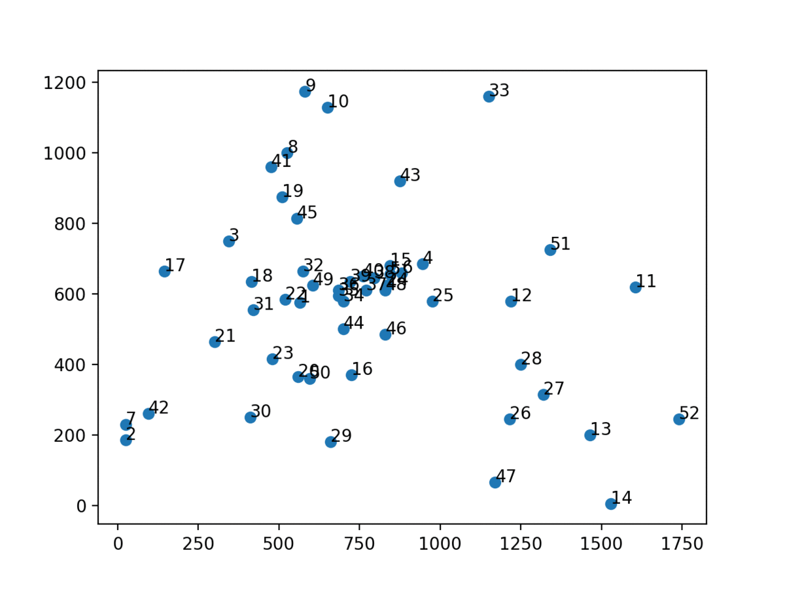
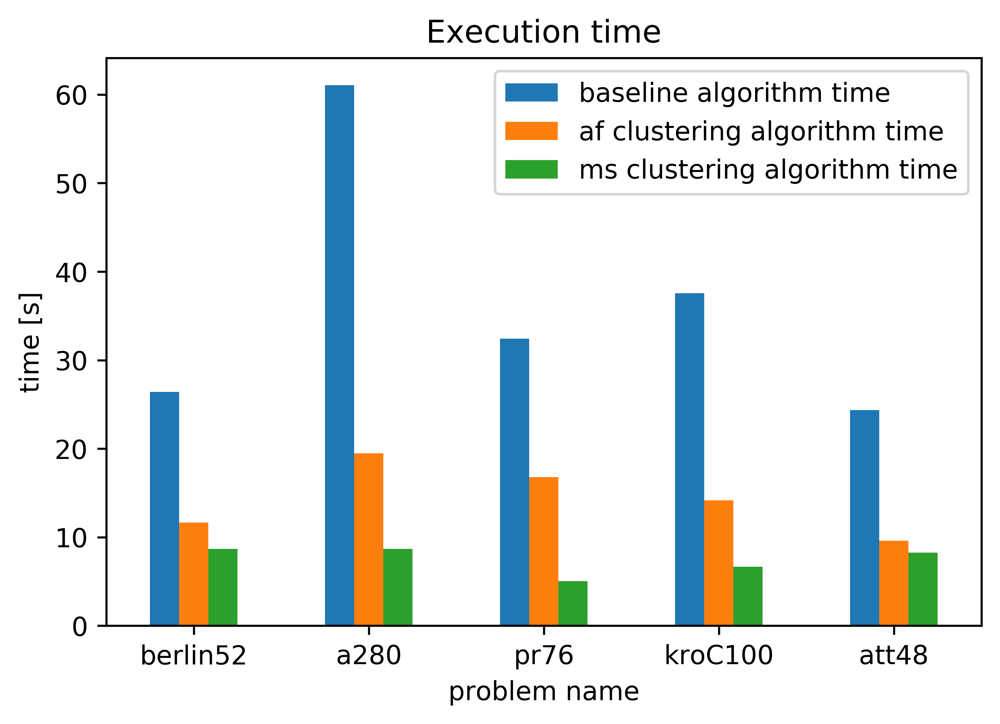
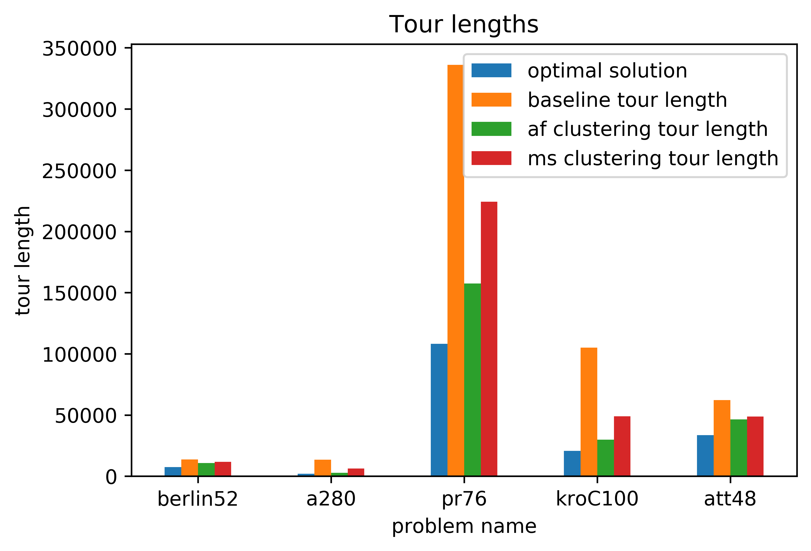

<div align="center">
  <h1>Solving TSP's using Clustering</h1>
  
</div>

### Introduction

In this project, clustering techniques are used to improve the speed in which a genetic algorithm can find a good solution for a travelling salesman problem. As a baseline, the genetic algorithm is used to find an optimal tour. 
In this project, clustering techniques (affinity propagation & mean shift) are used to divide the problems into smaller subproblems. The same genetic algorithm is used to both find the shortest tour passing through all cluster centres as well as to find the shortest tour within each subproblem. After finding all the optimal tours of the subproblems they are connected to create the final solution. 

### Results

To test the approach problems from the following academic dataset were used. [(Data)](http://comopt.ifi.uni-heidelberg.de/software/TSPLIB95/tsp/)

<p align="center">
  
</p>
<p align="center">
   
</p>


### Installation

1. Clone the repository: `git clone [repo-url]`
2. Install all dependencies: `pipenv install --dev`

### Run

```python
pipenv run python -m tsp_solver_clustering 
